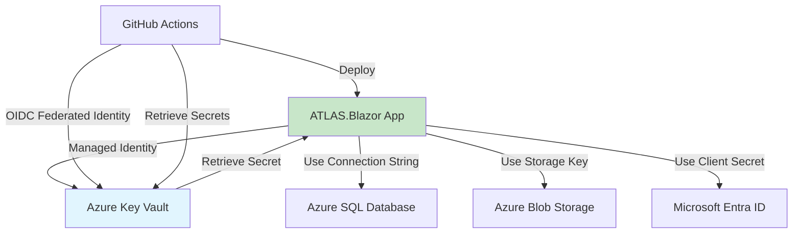

# ADR-009: Use Azure Key Vault for Secrets Management

## Status

### Partially Implemented

**Implementation Notes:**
- Development uses user-secrets for local development
- Azure Key Vault packages installed but not fully configured
- Full Azure Key Vault integration deferred to Milestone 9 (Production Hardening)
- Connection strings currently retrieved from configuration (not Key Vault)

## Context

ATLAS is a public-sector application handling sensitive permit data and personally identifiable information (PII). The application requires multiple secrets and connection strings:

1. **Azure SQL Database connection string** - Required by Entity Framework Core
2. **Azure Blob Storage connection string/key** - Required for document uploads
3. **Microsoft Entra ID client secrets** - Required for authentication (ADR-008)
4. **SendGrid/email service API keys** - Required for notifications (F-06)
5. **Application Insights instrumentation key** - Required for telemetry

**Current State (MVP Planning):**

- No centralized secrets management documented
- Risk of secrets in source control or local configuration files
- No rotation policy for credentials
- Public sector compliance requires centralized secrets management

Alternative approaches considered:

- **Environment Variables** - Simple but not secure for production; no audit trail; no rotation
- **appsettings.json with user secrets (dev)** - Development only; not suitable for production
- **Azure App Service Configuration** - Good for settings, but Key Vault is purpose-built for secrets with hardware security modules (HSMs)
- **GitHub Secrets (CI/CD only)** - Limited to build/deployment; not for runtime access

## Decision

We will use **Azure Key Vault** for all application secrets management, integrated with Azure App Service (ATLAS.Blazor hosting) via Managed Identity.

### Architecture Pattern



### Secrets to Store in Key Vault

| Secret Name | Purpose | Access Required |
|-------------|---------|-----------------|
| `SqlConnectionString` | Azure SQL Database connection | ATLAS.Blazor (App Service) |
| `BlobStorageConnectionString` | Azure Blob Storage access | ATLAS.Blazor (App Service) |
| `EntraID-ClientSecret` | Microsoft Entra ID app authentication | ATLAS.Blazor (App Service) |
| `SendGrid-ApiKey` | Email notification service | ATLAS.Blazor (App Service) |
| `ApplicationInsights-ConnectionString` | Telemetry and monitoring | ATLAS.Blazor (App Service) |

### Access Pattern

**Development Environment:**

- Use Azure Key Vault with developer's Entra ID credentials (AzureCli/VisualStudio authentication)
- Fallback to `dotnet user-secrets` for local development without Azure connectivity

**Production Environment:**

- Azure App Service uses **System-Assigned Managed Identity** to access Key Vault
- No client secrets stored in App Service configuration
- Key Vault firewall restricts access to authorized identities only

**CI/CD (GitHub Actions):**

- Use **OIDC Federated Identity** (ADR-006) to authenticate to Key Vault
- No GitHub secrets storing Azure credentials
- Retrieve deployment secrets at build time via OIDC

### Implementation in .NET 9

```csharp
// Program.cs (ATLAS.Blazor)
using Azure.Identity;
using Azure.Security.KeyVault.Secrets;

var builder = WebApplication.CreateBuilder(args);

// Add Azure Key Vault to configuration
if (!builder.Environment.IsDevelopment())
{
    var keyVaultUrl = builder.Configuration["KeyVault:Url"];
    var credential = new DefaultAzureCredential();
    builder.Configuration.AddAzureKeyVault(new Uri(keyVaultUrl), credential);
}

// Access secret
var sqlConnectionString = builder.Configuration["SqlConnectionString"];
```

### Bicep Definition (ADR-007)

```bicep
resource keyVault 'Microsoft.KeyVault/vaults@2023-07-01' = {
  name: 'kv-atlas-${environment}'
  location: location
  properties: {
    sku: {
      family: 'A'
      name: 'standard' // Or 'premium' for HSM
    }
    tenantId: tenantId
    accessPolicies: [
      {
        tenantId: tenantId
        objectId: appServiceManagedIdentityObjectId
        permissions: {
          secrets: ['get', 'list']
        }
      }
    ]
    enabledForDeployment: true
    enabledForTemplateDeployment: true
    enableRbacAuthorization: true // Use Azure RBAC for finer control
  }
}
```

## Consequences

### Positive

1. **Compliance** - Meets public sector requirements for centralized secrets management
2. **Security** - No secrets in source control, configuration files, or App Service settings
3. **Auditability** - All secret access logged in Key Vault logs (integrated with Azure Monitor)
4. **Rotation** - Native support for secret rotation with automated policies
5. **Managed Identity** - No client secrets stored; uses Azure AD authentication
6. **OIDC for CI/CD** - GitHub Actions authenticates via federated identity, not stored credentials

### Negative

1. **Complexity** - Additional infrastructure component to provision and manage
2. **Dependency** - Application cannot start without Key Vault access (network/firewall issues can block startup)
3. **Cost** - Standard tier ~$0.03/secret/month + API operations (minimal for ATLAS scale)
4. **Learning Curve** - Team must understand Managed Identity and DefaultAzureCredential chain

### Mitigations

- **Development Experience**: Provide `dotnet user-secrets` fallback for local dev without Azure connectivity
- **Resilience**: Add retry logic and circuit breaker for Key Vault access (Polly)
- **Documentation**: Document Managed Identity setup in `docs/engineering/` onboarding guide
- **Testing**: Mock IConfiguration interface in unit tests; use TestContainers for integration tests

## Alternatives Considered

### Environment Variables

- **ALT-001**: **Description**: Store secrets in App Service configuration (environment variables)
- **ALT-001**: **Rejection Reason**: Not secure for production; secrets visible in App Service configuration blade; no audit trail; no rotation

### Azure App Configuration

- **ALT-002**: **Description**: Use Azure App Configuration for settings and secrets
- **ALT-002**: **Rejection Reason**: App Configuration is designed for feature flags and settings; Key Vault is purpose-built for secrets with HSM support

### GitHub Secrets Only

- **ALT-003**: **Description**: Store all secrets in GitHub Secrets, pass via CI/CD
- **ALT-003**: **Rejection Reason**: Only accessible during build/deployment; not available at runtime; requires storing credentials in GitHub

## References

- **ADR-003**: Azure SQL + Blob Storage (secrets for these services stored in Key Vault)
- **ADR-006**: GitHub Actions (uses OIDC federated identity to access Key Vault)
- **ADR-007**: Bicep (Key Vault resource definition)
- **ADR-008**: Microsoft Entra ID (client secret stored in Key Vault)
- **PRD NFR-04, NFR-05**: Encryption requirements (Key Vault supports customer-managed keys)
- **PRD F-20**: Audit requirements (Key Vault access logging)

## Future Enhancements

### Customer-Managed Keys (CMK)

For additional compliance (FedRAMP, etc.), consider:

- Store Azure SQL TDE keys in Key Vault
- Store Azure Blob Storage encryption keys in Key Vault
- Requires Key Vault Premium tier (HSM)

### Secret Rotation Automation

- Implement Azure Function to rotate secrets on a schedule
- Notify stakeholders before expiration
- Integrate with Entra ID for certificate-based authentication rotation

---

**Next Steps:**

1. Add Key Vault to `plans/atlas-foundation-plan.md` Milestone 1 or 3
2. Update Bicep templates (ADR-007) to include Key Vault resource
3. Document Managed Identity setup in onboarding guide
4. Add Key Vault access logging to Azure Monitor workspace
