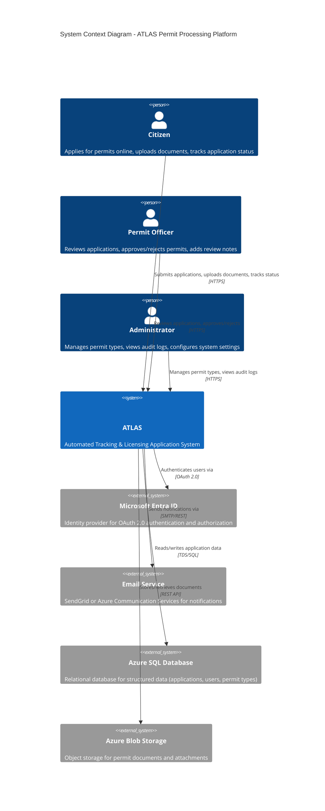

# System Context Diagram

## Overview

This diagram shows ATLAS (Automated Tracking & Licensing Application System) in the context of its users and external systems. It follows the C4 Model Context diagram convention.

## Context Diagram



## Actors

### Primary Actors

| Actor | Description | Responsibilities |
| ------- | ------------- | ----------------- |
| **Citizen** | Public user applying for permits | Submit applications, upload documents, track status, receive notifications |
| **Permit Officer** | Government staff reviewing applications | Review applications, approve/reject, add internal notes, request additional info |
| **Administrator** | System administrator | Manage permit types, configure system, view audit logs, manage users |

### External Systems

| System | Type | Purpose |
| -------- | ------ | --------- |
| **Microsoft Entra ID** | Identity Provider | OAuth 2.0 authentication, role-based access control (RBAC) |
| **Email Service** | Notification | Send status change notifications, confirmation emails |
| **Azure SQL Database** | Data Store | Persistent storage for applications, users, permit types, audit logs |
| **Azure Blob Storage** | Document Store | Unstructured storage for uploaded documents (PDF, JPG, PNG) |

## Trust Boundaries

```text
[Public Internet] ─────┐
                       │ HTTPS
[Microsoft Entra ID] ──┼─── [ATLAS Application] ──── [Azure SQL Database]
[Email Service] ───────┘              │
                                      ├─── [Azure Blob Storage]
                                      │
[Internal Network] ───────────────────┘
```

## Security Context

- **Authentication**: Microsoft Entra ID with MFA for all users (Citizens, Officers, Administrators)
- **Authorization**: Role-based access control (Citizen, Officer, Admin)
- **Encryption**: TLS 1.3 for data in transit; Azure Storage Service Encryption for data at rest
- **Compliance**: Government data sovereignty (West Europe region); 7-year audit retention

## References

- [ATLAS PRD - Stakeholders](../PRDs/atlas-mvp-prd.md#3-stakeholders)
- [ATLAS PRD - Functional Requirements](../PRDs/atlas-mvp-prd.md#5-functional-requirements)
- [Clean Architecture - Context](https://c4model.com/)
