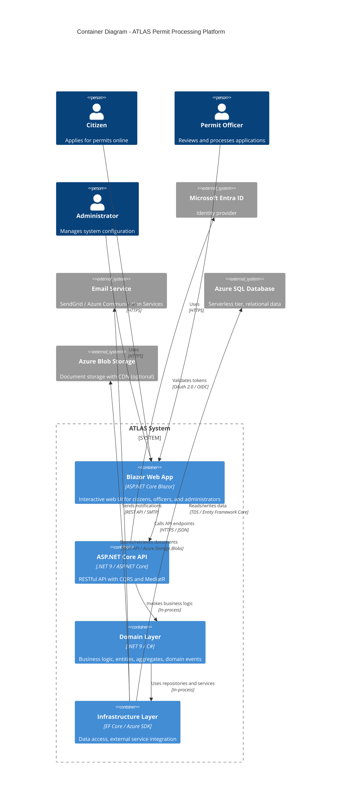

# Container Diagram

## Overview

This diagram shows the internal containers (deployable units) that make up ATLAS and how they interact with each other and external systems.

## Container Diagram



## Containers

### 1. Blazor Web App (Presentation Layer)

| Property | Value |
|----------|-------|
| **Technology** | ASP.NET Core Blazor (Server or WebAssembly) |
| **Purpose** | Interactive web UI for all user roles |
| **Responsibilities** | Render UI components, handle user interactions, call API endpoints |
| **Key Components** | Pages (Razor components), ViewModels, API clients, Authentication state |

**Features by Role:**
- **Citizens**: Application form, document upload, status dashboard
- **Officers**: Review dashboard, application details, approval/rejection workflow
- **Administrators**: Permit type management, audit log viewer, user management

### 2. ASP.NET Core API (Application Layer)

| Property | Value |
|----------|-------|
| **Technology** | ASP.NET Core 9, MediatR, FluentValidation |
| **Purpose** | RESTful API with CQRS pattern |
| **Responsibilities** | Handle HTTP requests, route commands/queries, return responses |
| **Key Components** | Controllers, Command/Query handlers, DTOs, Validators |

**API Structure (CQRS):**
- **Commands** (Write): `CreateApplication`, `ApproveApplication`, `RejectApplication`, `CreatePermitType`
- **Queries** (Read): `GetApplicationById`, `GetApplicationsByStatus`, `GetPermitTypes`

### 3. Domain Layer (Business Logic)

| Property | Value |
|----------|-------|
| **Technology** | .NET 9 / C# (no external dependencies) |
| **Purpose** | Core business logic and rules |
| **Responsibilities** | Enforce invariants, domain events, entity behavior |
| **Key Components** | Entities, Aggregates, Value Objects, Domain Services, Domain Events |

**Core Concepts:**
- `Application` (Aggregate Root), `PermitType`, `Document`, `Review`, `User`
- Domain Events: `ApplicationSubmitted`, `ApplicationApproved`, `DocumentUploaded`

### 4. Infrastructure Layer (Data Access & External Services)

| Property | Value |
|----------|-------|
| **Technology** | EF Core, Azure SDK for .NET, MediatR |
| **Purpose** | Implement interfaces defined in Domain/Application layers |
| **Responsibilities** | Data persistence, external service integration, cross-cutting concerns |
| **Key Components** | Repositories, DbContext, Blob Storage service, Email service, Caching |

**Integrations:**
- **EF Core** → Azure SQL Database (relational data)
- **Azure.Storage.Blobs** → Azure Blob Storage (documents)
- **Azure.Identity** → Microsoft Entra ID (authentication)
- **SendGrid/Azure.Communication** → Email Service (notifications)

## Data Flow Summary

```
[User] → [Blazor Web App] → [ASP.NET Core API] → [Domain Layer] → [Infrastructure Layer] → [Azure SQL / Blob Storage]
                                                                              ↓
                                                                     [Email Service] (notifications)
                                                                     [Entra ID] (auth)
```

## Deployment Mapping

| Container | Azure Service | Scaling |
|-----------|--------------|---------|
| Blazor Web App + API | Azure App Service (Windows/Linux) | Scale out based on CPU/memory |
| Azure SQL Database | Azure SQL Serverless | Auto-scaling based on workload |
| Azure Blob Storage | Azure Blob Storage (Hot tier) | Unlimited scale, geo-redundant |

## References

- [ATLAS PRD - Technology Stack](../PRDs/atlas-mvp-prd.md#technology-stack)
- [Clean Architecture - Container Boundaries](https://blog.cleancoder.com/uncle-bob/2012/08/13/the-clean-architecture.html)
- [CQRS Pattern](https://martinfowler.com/bliki/CQRS.html)
