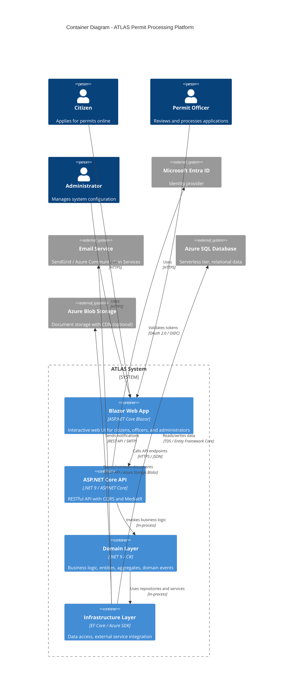

# Container Diagram

## Overview

This diagram shows the internal containers (deployable units) that make up ATLAS and how they interact with each other and external systems.

## Container Diagram details



## Containers

### 1. Blazor Web App (Presentation Layer)

| Property | Value |
| ---------- | ------- |
| **Technology** | ASP.NET Core Blazor (Server or WebAssembly) |
| **Purpose** | Interactive web UI for all user roles |
| **Responsibilities** | Render UI components, handle user interactions, call API endpoints |
| **Key Components** | Pages (Razor components), ViewModels, API clients, Authentication state |

**Features by Role:**

- **Citizens**: Application form, document upload, status dashboard
- **Officers**: Review dashboard, application details, approval/rejection workflow
- **Administrators**: Administration Portal (Milestone 8 Phase A1 foundation)
  - **Administration Dashboard** (implemented): lightweight summary counts (permit types, applications, officers, active email templates) via the `GetAdminDashboardQuery` CQRS query
  - **Planned areas** (placeholder pages, no business logic yet): Permit Types, Dynamic Forms, Email Templates, Reference Data, Officers, System Settings
  - Authorization: restricted to the `Admin` Entra ID role; Officers, Citizens, and anonymous users are denied (user management delegated to Entra ID)

### 2. ASP.NET Core API (Application Layer)

| Property | Value |
| ---------- | ------- |
| **Technology** | ASP.NET Core 9, MediatR, FluentValidation |
| **Purpose** | RESTful API with CQRS pattern |
| **Responsibilities** | Handle HTTP requests, route commands/queries, return responses |
| **Key Components** | Controllers, Command/Query handlers, DTOs, Validators |

**API Structure (CQRS):**

- **Commands** (Write): `CreateApplication`, `ApproveApplication`, `RejectApplication`, `CreatePermitType`
- **Queries** (Read): `GetApplicationById`, `GetApplicationsByStatus`, `GetPermitTypes`

### 3. Domain Layer (Business Logic)

| Property | Value |
| ---------- | ------- |
| **Technology** | .NET 9 / C# (no external dependencies) |
| **Purpose** | Core business logic and rules |
| **Responsibilities** | Enforce invariants, domain events, entity behavior |
| **Key Components** | Entities, Aggregates, Value Objects, Domain Services, Domain Events |

**Core Concepts:**

- `Application` (Aggregate Root), `PermitType`, `Document`, `Review`, `User`
- Domain Events: `ApplicationSubmitted`, `ApplicationApproved`, `DocumentUploaded`

### 4. Infrastructure Layer (Data Access & External Services)

| Property | Value |
| ---------- | ------- |
| **Technology** | EF Core, Azure SDK for .NET, MediatR |
| **Purpose** | Implement interfaces defined in Domain/Application layers |
| **Responsibilities** | Data persistence, external service integration, cross-cutting concerns |
| **Key Components** | Repositories, DbContext, Blob Storage service, Email service, Caching |

**Integrations:**

- **EF Core** → Azure SQL Database (relational data)
- **Azure.Storage.Blobs** → Azure Blob Storage (documents)
- **Azure.Identity** → Microsoft Entra ID (authentication)
- **SendGrid/Azure.Communication** → Email Service (notifications)

## Supported Experiences (Blazor Portals)

ATLAS exposes three role-scoped Blazor experiences, all hosted within the single Blazor Web App container and sharing the common app shell, navigation, styling, and Entra ID authentication. Each experience is gated by an authorization policy derived from the user's Entra ID role (`UserRole`: Citizen = 1, Officer = 2, Admin = 3).

| Experience | Route Prefix | Intended Audience | Authorization Boundary | Status (Milestone 8 Phase A1) |
| ----------- | ------------ | ----------------- | ---------------------- | ----------------------------- |
| **Citizen Portal** | `/` (root) | Members of the public applying for permits | `Citizen` role (policy `Citizen`) | Established in earlier milestones |
| **Officer Portal** | `/officer/*` | Permit officers reviewing applications | `Officer` role (policy `Officer`, or `OfficerOrAdmin`) | Established in earlier milestones |
| **Administration Portal** | `/admin/*` | System administrators | `Admin` role (policy `Admin`) | Foundation implemented this phase |

### Administration Portal (Milestone 8 Phase A1)

The Administration Portal is a new, third experience introduced in Milestone 8 Phase A1. It reuses the existing app shell, navigation, and styling, and is available only to users assigned the `Admin` Entra ID role.

**Responsibilities & scope:**

- **Administration Dashboard** (`/admin`): lightweight, read-only summary counts (permit types, applications, officers, active email templates) sourced from the `GetAdminDashboardQuery` CQRS query. No write operations.
- **Placeholder areas** (no business logic in this phase): Permit Types (`/admin/permit-types`), Dynamic Forms (`/admin/forms`), Email Templates (`/admin/email-templates`), Reference Data (`/admin/reference-data`), Officers (`/admin/officers`), System Settings (`/admin/settings`). Each renders a `PageHeader` and an `EmptyState` indicating the capability is planned for a later phase.

**Authorization model:**

- Pages declare `[Authorize(Roles = "Admin")]`.
- `NavMenu` shows the **Administration** entry only inside an `<AuthorizeView Roles="Admin">` block.
- Officers, Citizens, and anonymous users are denied access; user/role management itself remains delegated to Entra ID.

**Relationships:**

- Consumes the same Application-layer CQRS pipeline (MediatR) as the other portals.
- Reads via the existing repository interfaces (`IPermitTypeRepository`, `IApplicationRepository`, `IUserRepository`); writes for the placeholder areas are deferred to later phases.

## Data Flow Summary

```text
[User] → [Blazor Web App] → [ASP.NET Core API] → [Domain Layer] → [Infrastructure Layer] → [Azure SQL / Blob Storage]
                                                                              ↓
                                                                     [Email Service] (notifications)
                                                                     [Entra ID] (auth)
```

## Deployment Mapping

| Container | Azure Service | Scaling |
| ----------- | -------------- | --------- |
| Blazor Web App + API | Azure App Service (Windows/Linux) | Scale out based on CPU/memory |
| Azure SQL Database | Azure SQL Serverless | Auto-scaling based on workload |
| Azure Blob Storage | Azure Blob Storage (Hot tier) | Unlimited scale, geo-redundant |

---

## Phase 4 Updates: Generated API Layer (NSwag)

**Status**: ✅ Implemented (2026-06-08)

### Changes to ASP.NET Core API Container

The API layer now uses **NSwag-generated controllers** from the OpenAPI contract (openapi/atlas-api.yaml). This ensures the API surface always matches the contract.

#### Before Phase 4 (Manual Controllers)

- Controllers manually maintained in Controllers/*.cs
- Required manual synchronization between contract and code
- Mixed concerns: routing, MediatR dispatch, mapping in single files

#### After Phase 4 (Generated Controllers)

- **Generated controllers**: Controllers/Generated/GeneratedControllers.g.cs (from NSwag)
- **Partial class adapters**: Controllers/Partial/*.partial.cs (custom MediatR integration)
- **DTO mapping layer**: Contracts/Generated/DtoMappingExtensions.cs (explicit *Response ↔*Dto mapping)

#### File Structure

`
Controllers/
├── Generated/                    ← NSwag-generated (regeneration-safe, don't edit)
│   └── GeneratedControllers.g.cs
└── Partial/                       ← Custom adapters (edit these)
    ├── ApplicationsController.partial.cs
    ├── PermitTypesController.partial.cs
    ├── UsersController.partial.cs
    ├── AuditLogsController.partial.cs
    └── DocumentsController.partial.cs

Contracts/
└── Generated/                    ← NSwag-generated DTOs
    ├── AtlasContracts.g.cs      ← *Request and*Response types
    └── DtoMappingExtensions.cs  ← Mapping to Application *Dto types
`

#### Benefits

1. **Single source of truth**: OpenAPI contract drives the API surface
2. **Regeneration-safe**: Custom code survives NSwag re-runs
3. **Clear separation**: Generated code (routing) vs custom code (MediatR, mapping)
4. **Explicit boundaries**: *Response (contract) vs*Dto (business) types

#### Preserved Architecture

- ✅ MediatR integration via partial class adapters
- ✅ CQRS pattern unchanged (Commands/Queries in Application layer)
- ✅ Validation pipeline (ValidationBehavior<TRequest, TResponse>)
- ✅ Authorization via ASP.NET Core conventions (not attributes on generated code)

### References

- [ATLAS PRD - Technology Stack](../PRDs/atlas-mvp-prd.md#technology-stack)
- [Clean Architecture - Container Boundaries](https://blog.cleancoder.com/uncle-bob/2012/08/13/the-clean-architecture.html)
- [CQRS Pattern](https://martinfowler.com/bliki/CQRS.html)
- [ADR-012: Generated API Layer with NSwag](../ADRs/adr-012-generated-api-layer.md)
- [OpenAPI Specification](../../openapi/atlas-api.yaml)
- [NSwag Documentation](https://github.com/RicoSuter/NSwag)
