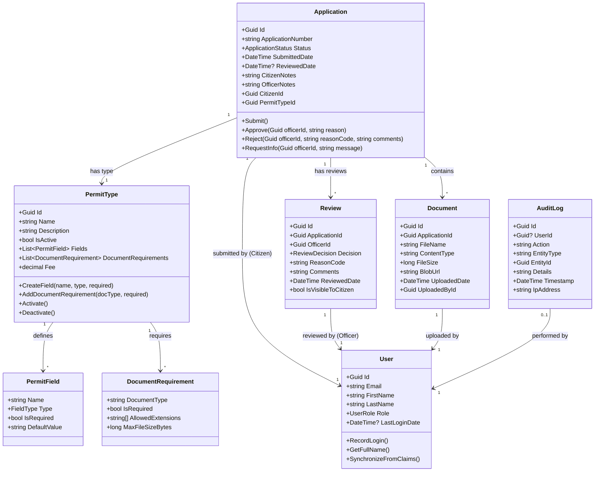

# Domain Model

## Overview

The ATLAS domain model represents the core business concepts for the permit processing platform. This model follows Domain-Driven Design (DDD) principles with clearly defined entities, value objects, aggregates, and their relationships.

## Core Domain Concepts

Based on the [ATLAS PRD](../PRDs/atlas-mvp-prd.md), the primary domain concepts are:

1. **Application** - A permit application submitted by a citizen
2. **PermitType** - Configurable permit categories defined by administrators
3. **User** - Synchronized Entra ID projection (Citizens, Officers, Administrators)
4. **Document** - Files uploaded in support of applications
5. **Review** - Officer's review of an application
6. **AuditLog** - Immutable record of all system actions

## Domain Model Diagram



## Relationships

| From | To | Relationship | Description |
| ------ | ---- | -------------- | ------------- |
| Application | PermitType | Many-to-One | Each application is for a specific permit type |
| Application | User (Citizen) | Many-to-One | Each application is submitted by one citizen |
| Application | Document | One-to-Many | An application can have multiple supporting documents |
| Application | Review | One-to-Many | An application can have multiple reviews (history) |
| Review | User (Officer) | Many-to-One | Each review is conducted by one officer |
| Document | User | Many-to-One | Each document is uploaded by one user |
| PermitType | PermitField | One-to-Many | Permit types define multiple fields |
| PermitType | DocumentRequirement | One-to-Many | Permit types specify document requirements |
| AuditLog | User | Many-to-One (optional) | Audit entries may be associated with a user |

## Value Objects

### ApplicationStatus (Enum)

```text
Submitted → UnderReview → Approved
                     ↘ InfoRequested → Resubmitted → UnderReview
                     ↘ Rejected
```

### UserRole (Enum)

- `Citizen` - Can submit and track applications
- `Officer` - Can review and process applications
- `Admin` - Can manage system configuration

### ReviewDecision (Enum)

- `Approve` - Application approved
- `Reject` - Application rejected with reason code
- `RequestInfo` - Additional information requested

### FieldType (Enum)

- `Text` - Free-text input
- `MultilineText` - Multi-line text area
- `Number` - Numeric input
- `Date` - Date picker
- `Boolean` - Boolean checkbox
- `Dropdown` - Single select from options

## Domain Invariants

1. **Application must have a valid PermitType** - Cannot submit without selecting type
2. **Application status transitions must be valid** - Cannot go from Approved to Submitted
3. **Rejection requires a reason code** - Mandatory field per PRD F-13
4. **Documents must be associated with an application** - Orphaned documents not allowed
5. **AuditLog entries are immutable** - Once created, cannot be modified or deleted
6. **PermitType must be active** - Cannot submit application for inactive permit type

## Domain Events

| Event | Trigger | Payload |
| ------- | --------- | --------- |
| `ApplicationSubmitted` | Citizen submits application | ApplicationId, CitizenId, PermitTypeId, Timestamp |
| `ApplicationApproved` | Officer approves application | ApplicationId, OfficerId, Timestamp |
| `ApplicationRejected` | Officer rejects application | ApplicationId, OfficerId, ReasonCode, Comments |
| `ApplicationAssignedToOfficerEvent` | Officer assigned to application | ApplicationId, OfficerId, OccurredOn |
| `ApplicationUnderReviewEvent` | Application status changes to UnderReview | ApplicationId, Timestamp |
| `DocumentUploaded` | User uploads document | DocumentId, ApplicationId, UserId, FileName |
| `PermitTypeCreated` | Admin creates permit type | PermitTypeId, AdminId, Name |
| `AuditLogCreated` | Any system action | Action, UserId, EntityType, EntityId |

## References

- [ATLAS PRD - Functional Requirements](../PRDs/atlas-mvp-prd.md#5-functional-requirements)
- [ATLAS PRD - User Stories](../PRDs/atlas-mvp-prd.md#4-specifications--use-cases)
- [Domain-Driven Design](https://domainlanguage.com/ddd/)
