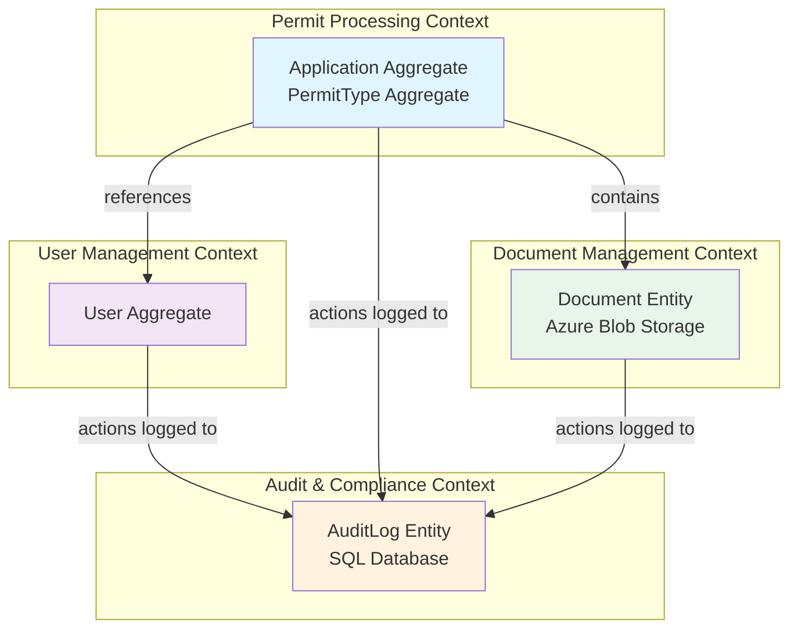

# Bounded Contexts

## Overview

Bounded Contexts are a central pattern in Domain-Driven Design (DDD) that define explicit boundaries around a specific domain model. Each bounded context has its own ubiquitous language, domain model, and rules.

## ATLAS Bounded Contexts

ATLAS can be divided into four bounded contexts, each with its own domain model and responsibilities:

---

### 1. Permit Processing Context

**Core Domain:** The primary business domain for permit applications.

**Ubiquitous Language:**

- Application, PermitType, Document, Review, ApplicationStatus
- Submit, Approve, Reject, RequestInfo
- Citizen, Officer

**Domain Model:**

```text
Application (Aggregate Root)
├── Document [0..*]
├── Review [0..*]
└── Status (ApplicationStatus)

PermitType (Aggregate Root)
├── PermitField [0..*]
└── DocumentRequirement [0..*]
```

**Responsibilities:**

- Manage permit application lifecycle
- Enforce application business rules and invariants
- Handle document uploads and validation
- Process officer reviews and decisions

**Key Use Cases:**

- UC1: Citizen Submits Permit Application
- UC2: Permit Officer Reviews Application
- F-01 to F-16 (Citizen and Officer functional requirements)

---

### 2. User Management Context

**Core Domain:** Authentication, authorization, and user lifecycle.

**Ubiquitous Language:**

- User, Role (Citizen/Officer/Admin), Account
- Activate, Deactivate, ChangeRole
- Authentication, Authorization

**Domain Model:**

```text
User (Aggregate Root)
├── Id, Email, FirstName, LastName
├── Role (UserRole)
└── IsActive
```

**Responsibilities:**

- User registration and profile management
- Role assignment and permission enforcement
- Account activation/deactivation
- Integration with Microsoft Entra ID (Officers/Admins) and local accounts (Citizens)

**Key Use Cases:**

- F-21: Administrators can manage user accounts and assign roles
- Authentication and authorization for all user types

---

### 3. Document Management Context

**Core Domain:** Storage and retrieval of permit-related documents.

**Ubiquitous Language:**

- Document, Blob, ContentType, FileSize
- Upload, Download, Delete
- Storage, Container, BlobUrl

**Domain Model:**

```text
Document (Entity, part of Application aggregate)
├── Id, ApplicationId, FileName
├── ContentType, FileSize
└── BlobUrl
```

**Responsibilities:**

- Store documents in Azure Blob Storage
- Generate secure access URLs (SAS tokens)
- Validate file types and size limits (25MB per PRD F-03)
- Handle document lifecycle (upload, download, delete on application rejection)

**Integration Points:**

- Uses Azure Blob Storage SDK
- Generates SAS tokens for secure access
- Enforces file type restrictions (PDF, JPG, PNG)

---

### 4. Audit & Compliance Context

**Core Domain:** Immutable audit trail for compliance and investigation.

**Ubiquitous Language:**

- AuditLog, Action, EntityType, EntityId
- Timestamp, IpAddress, Details
- Compliance, Retention, Investigation

**Domain Model:**

```text
AuditLog (Entity, separate bounded context)
├── Id, UserId (optional)
├── Action, EntityType, EntityId
├── Details, Timestamp, IpAddress
```

**Responsibilities:**

- Record all system actions immutably
- Maintain 7-year retention for compliance (PRD requirement)
- Provide audit trail for investigations
- Support export to CSV/Excel (F-23)

**Key Use Cases:**

- F-20: Administrators can view complete audit history
- F-23: Administrators can export audit data to CSV/Excel
- Compliance with government data regulations

---

## Context Map



## Context Relationships

### Permit Processing → User Management

**Relationship Type:** Shared Kernel (shared User concept)

- `Application.CitizenId` references `User.Id` (Citizen role)
- `Application` reviews reference `User.Id` (Officer role)
- User roles enforce permissions within Permit Processing context

**Integration Pattern:** Direct reference via foreign key (same database)

### Permit Processing → Document Management

**Relationship Type:** Contains (Documents belong to Applications)

- Documents are part of the Application aggregate
- Document metadata stored in SQL, blobs in Azure Blob Storage
- Documents cannot exist without an Application

**Integration Pattern:** Application aggregate controls document lifecycle

### All Contexts → Audit & Compliance

**Relationship Type:** Published Event (Domain Events)

- All contexts publish domain events (e.g., `ApplicationSubmitted`, `UserRoleChanged`)
- Audit context subscribes to events and creates `AuditLog` entries
- Loose coupling via event-driven architecture

**Integration Pattern:** Domain Events → MediatR Notification → AuditLog Created

```csharp
// Example: ApplicationSubmitted event handler in Audit context
public class ApplicationSubmittedEventHandler : INotificationHandler<ApplicationSubmittedEvent>
{
    private readonly IAuditLogRepository _auditLogRepository;

    public async Task Handle(ApplicationSubmittedEvent notification, CancellationToken cancellationToken)
    {
        var auditLog = new AuditLog(
            userId: notification.CitizenId,
            action: "APPLICATION_SUBMITTED",
            entityType: "Application",
            entityId: notification.ApplicationId,
            details: $"PermitTypeId: {notification.PermitTypeId}"
        );

        await _auditLogRepository.AddAsync(auditLog);
    }
}
```

## Context Boundaries Summary

| Context | Aggregate Roots | Database Tables | External Dependencies |
| --------- | ------------------ | ----------------- | ---------------------- |
| **Permit Processing** | Application, PermitType | Applications, PermitTypes, Documents, Reviews | None (pure domain) |
| **User Management** | User | Users | Microsoft Entra ID (Officers/Admins) |
| **Document Management** | Document (entity) | Documents (metadata only) | Azure Blob Storage |
| **Audit & Compliance** | AuditLog | AuditLogs | None (read-only consumers) |

## Future Context Splitting

As the system evolves, consider splitting:

1. **Workflow Engine Context** - If complex multi-stage approvals needed (see [Extension Points](08-extension-points.md))
2. **Notification Context** - If rich notification rules and templates required
3. **Reporting Context** - If complex analytics and dashboards needed (CQRS read models)

## References

- [ATLAS Domain Model](03-domain-model.md)
- [Aggregate Roots](05-aggregate-roots.md)
- [Data Flow Diagrams](07-data-flow.md)
- [Domain-Driven Design - Bounded Contexts](https://martinfowler.com/bliki/BoundedContext.html)
- [Context Mapping Patterns](https://www.infoq.com/articles/ddd-contextmapping/)
