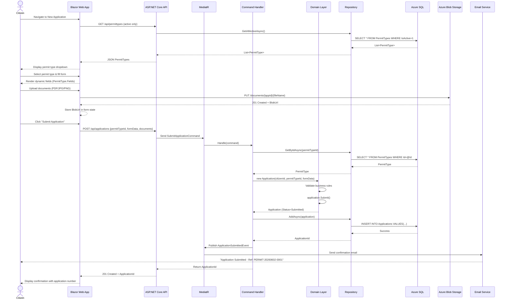
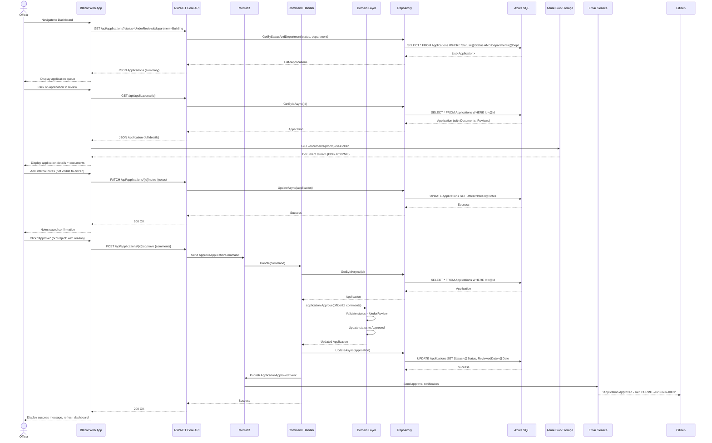
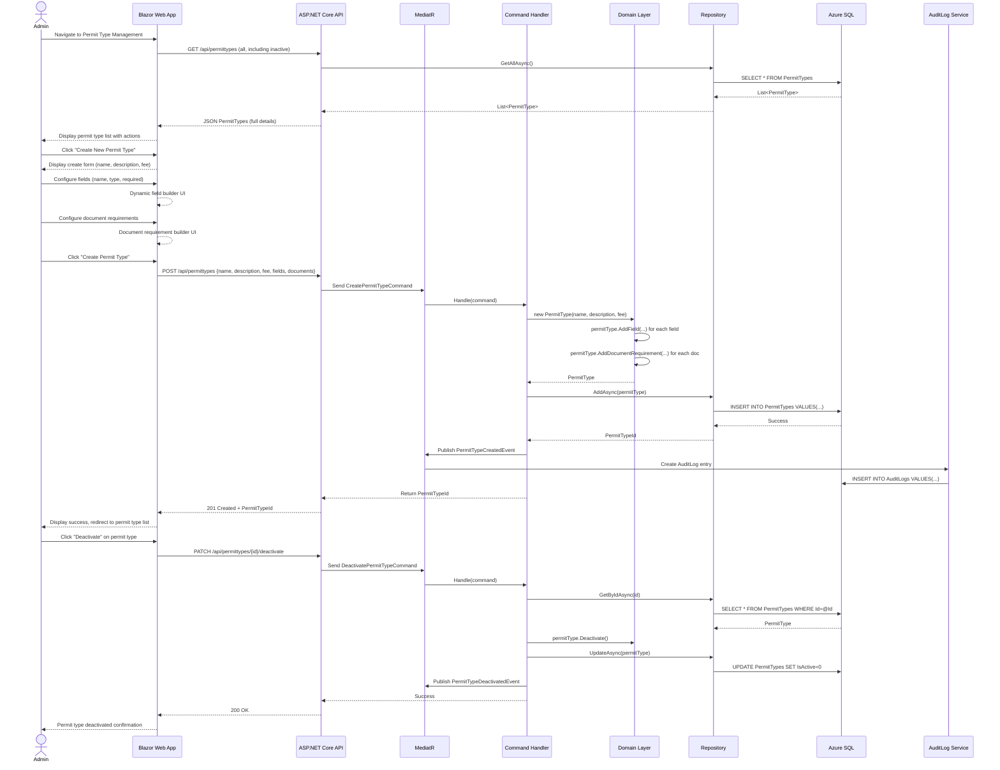

# Data Flow Diagrams

## Overview

This document illustrates the key data flows and process interactions in ATLAS using sequence diagrams. These flows show how data moves between the Blazor Web App, ASP.NET Core API, Domain Layer, and external systems.

## Prerequisites

- **User is authenticated** via Microsoft Entra ID (all user types — Citizen, Officer, Admin)
- **User has appropriate role** (Citizen, Officer, Admin) for the operation

---

## Flow 1: Citizen Submits Permit Application

**Key Data Transformations:**

- Form data → `Application` entity (Domain Layer)
- Uploaded files → Azure Blob Storage (BlobUrl stored in `Document` entity)
- `SubmitApplicationCommand` → `ApplicationSubmittedEvent` (MediatR)

---

## Flow 2: Officer Reviews Application

**Key Data Transformations:**

- `ApproveApplicationCommand` → `application.Approve()` → `ApplicationApprovedEvent`
- Officer notes stored in `Application.OfficerNotes` (not visible to citizens)
- Status change triggers email notification via MediatR domain event

---

## Flow 3: Administrator Manages Permit Types

**Key Data Transformations:**

- Form data → `PermitType` entity with `PermitField` and `DocumentRequirement` value objects
- `CreatePermitTypeCommand` → `PermitTypeCreatedEvent` → `AuditLog` entry
- Deactivation sets `IsActive=false` (soft delete, existing applications unaffected)

---

## Data Flow Summary

| Flow | Trigger | Key Data Stores | Domain Events |
| ------ | ---------- | ----------------- | --------------- |
| **Citizen Submission** | Submit Application button | Azure SQL (Application), Blob Storage (Documents) | `ApplicationSubmittedEvent` |
| **Officer Review** | Approve/Reject button | Azure SQL (Application, Review), Blob Storage (read) | `ApplicationApprovedEvent` / `ApplicationRejectedEvent` |
| **Admin Permit Type** | Create/Update/Deactivate | Azure SQL (PermitType) | `PermitTypeCreatedEvent`, `PermitTypeDeactivatedEvent` |

## References

- [ATLAS PRD - Use Cases](../PRDs/atlas-mvp-prd.md#4-specifications--use-cases)
- [Container Diagram](02-container-diagram.md)
- [Domain Model](03-domain-model.md)
- [CQRS Pattern with MediatR](https://github.com/jbogard/MediatR)
