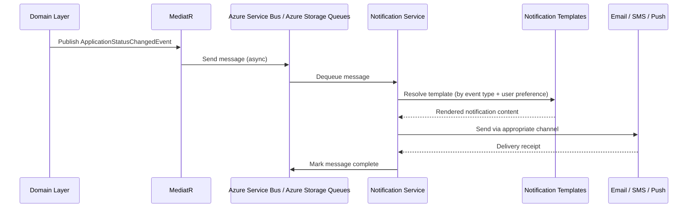
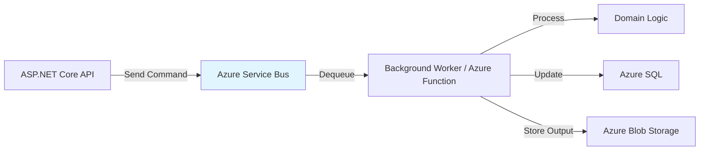
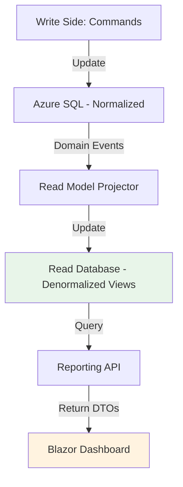
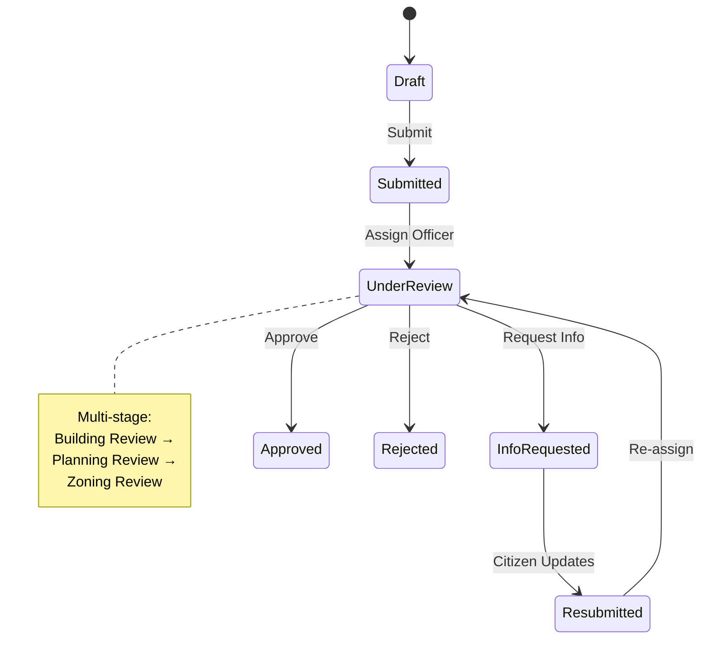

# Future Extension Points

## Overview

This document identifies future extension points for ATLAS based on the current Clean Architecture + CQRS + DDD foundation. These extensions align with the MVP out-of-scope items and future business needs identified in the [ATLAS PRD](../PRDs/atlas-mvp-prd.md).

---

## 1. Notification Service

### Current State (MVP)

- Basic email notifications via SendGrid/Azure Communication Services
- Triggered by domain events (`ApplicationSubmittedEvent`, `ApplicationApprovedEvent`)
- Simple notification handler in Infrastructure layer

### Extension: Event-Driven Notification Service

**Future Capability:** Rich, multi-channel notification system with templates, preferences, and delivery tracking.

**Architecture Pattern:** Domain Events → Message Queue → Notification Service



**Key Components to Add:**

| Component | Layer | Responsibility |
|-----------|-------|----------------|
| `INotificationService` | Application Layer (interface) | Define notification contracts |
| `NotificationTemplate` | Domain Layer (entity) | Template definition with variables |
| `NotificationPreference` | Domain Layer (value object) | User's channel preferences |
| `NotificationService` | Infrastructure Layer | Implement multi-channel sending |
| `NotificationLog` | Infrastructure Layer | Track delivery status and history |

**Integration Pattern:**
```csharp
// Application Layer - Command/Query side
public class ApplicationApprovedEventHandler : INotificationHandler<ApplicationApprovedEvent>
{
    private readonly INotificationService _notificationService;

    public async Task Handle(ApplicationApprovedEvent notification, CancellationToken ct)
    {
        await _notificationService.SendAsync(
            userId: notification.CitizenId,
            templateKey: "APPLICATION_APPROVED",
            variables: new { ApplicationNumber = notification.ApplicationNumber }
        );
    }
}
```

**Future ADR:** `adr-004-notification-service.md` - Design and implementation of event-driven notification system.

---

## 2. Service Bus Integration

### Current State (MVP)

- Synchronous processing for all operations
- Domain events handled in-process via MediatR
- No message queuing or async processing

### Extension: Azure Service Bus for Async Processing

**Future Capability:** Decouple long-running processes, batch jobs, and external system integrations using Azure Service Bus.

**Use Cases:**
- **Document Scanning** - Virus scan uploaded documents asynchronously
- **Email Batching** - Batch notifications for digest emails
- **Audit Log Export** - Async export to CSV/Excel (F-23)
- **External Integrations** - GIS systems, property records, state databases (out-of-scope for MVP)

**Architecture Pattern:** Command → Service Bus Queue/Topic → Background Worker/Function



**Implementation Approach:**

| Scenario | Service Bus Pattern | Handler |
|----------|---------------------|---------|
| Document virus scan | Queue (competing consumers) | `DocumentScanWorker` |
| Email batching | Topic (pub/sub) | `EmailBatchFunction` |
| Audit export | Queue (single consumer) | `AuditExportWorker` |

**Code Example:**
```csharp
// Sending a message to Service Bus
public class DocumentUploadedEventHandler : INotificationHandler<DocumentUploadedEvent>
{
    private readonly ServiceBusSender _sender;

    public async Task Handle(DocumentUploadedEvent notification, CancellationToken ct)
    {
        var message = new ServiceBusMessage
        {
            Body = BinaryData.FromObjectAsJson(new
            {
                DocumentId = notification.DocumentId,
                BlobUrl = notification.BlobUrl
            })
        };

        await _sender.SendMessageAsync(message, ct);
    }
}
```

**Future ADR:** `adr-005-service-bus-integration.md` - Async processing strategy with Azure Service Bus.

---

## 3. Reporting & Analytics

### Current State (MVP)

- Basic audit log viewing (F-20)
- No reporting or analytics capabilities
- Out-of-scope for MVP (per PRD)

### Extension: CQRS Read Models for Reporting

**Future Capability:** Rich reporting dashboard, analytics, and data exports using CQRS query side optimization.

**Architecture Pattern:** CQRS + Read Model Projections



**Read Models to Create:**

| Read Model | Purpose | Data Source |
|------------|---------|-------------|
| `ApplicationSummaryView` | Dashboard lists, search results | Applications + PermitTypes |
| `ApplicationDetailView` | Detail view (read-only) | Applications + Documents + Reviews |
| `OfficerPerformanceView` | Officer productivity metrics | Reviews + Users |
| `PermitTypeStatsView` | Permit type usage statistics | Applications + PermitTypes |
| `AuditLogView` | Filtered audit log for export | AuditLogs |

**Implementation Example:**
```csharp
// Read Model Projector (updates denormalized views)
public class ApplicationSubmittedEventHandler : INotificationHandler<ApplicationSubmittedEvent>
{
    private readonly ReadDbContext _readDb;

    public async Task Handle(ApplicationSubmittedEvent notification, CancellationToken ct)
    {
        var summaryView = new ApplicationSummaryView
        {
            ApplicationId = notification.ApplicationId,
            ApplicationNumber = notification.ApplicationNumber,
            CitizenName = notification.CitizenName,
            PermitTypeName = notification.PermitTypeName,
            Status = "Submitted",
            SubmittedDate = notification.Timestamp,
            LastUpdated = notification.Timestamp
        };

        _readDb.ApplicationSummaries.Add(summaryView);
        await _readDb.SaveChangesAsync(ct);
    }
}
```

**Reporting Features:**
- **Real-time dashboards** - Blazor components bound to read models
- **Export to CSV/Excel** - F-23 requirement (Could priority)
- **Scheduled reports** - Email reports to administrators weekly/monthly
- **Ad-hoc queries** - Power BI integration via Azure SQL Direct Query

**Future ADR:** `adr-006-reporting-read-models.md` - CQRS read model strategy for reporting and analytics.

---

## 4. Workflow Engine

### Current State (MVP)

- Simple linear workflow: Submitted → UnderReview → Approved/Rejected
- Single officer review per application
- No support for multi-stage approvals or complex routing

### Extension: State Machine Workflow Engine

**Future Capability:** Configurable, multi-stage approval workflows with complex routing rules.

**Business Scenarios:**
- **Multi-Officer Approval** - Application requires reviews from Building + Planning + Zoning departments
- **Conditional Approval** - Approve with conditions that citizen must satisfy
- **Escalation Rules** - Auto-escalate if not reviewed within SLA (e.g., 8 days)
- **Department Routing** - Route application to appropriate department based on permit type

**Architecture Pattern:** State Machine + Workflow Engine (e.g., Microsoft Workflow Foundation, Elsa Workflows, or custom state machine)



**Workflow Definition:**

| Stage | Actor | Action | Next State |
|-------|--------|--------|------------|
| 1 | Citizen | Submit | Submitted |
| 2 | System | Route to Department | UnderReview (Building) |
| 3 | Building Officer | Approve | UnderReview (Planning) |
| 4 | Planning Officer | Approve | UnderReview (Zoning) |
| 5 | Zoning Officer | Approve | Approved |
| Any Stage | Officer | Reject | Rejected |
| Any Stage | Officer | Request Info | InfoRequested |

**Implementation Approach:**

```csharp
// Workflow Engine interface
public interface IWorkflowEngine
{
    Task<WorkflowResult> ProcessAsync(Guid applicationId, WorkflowAction action, Guid userId, string comments);
    Task<IEnumerable<WorkflowStage>> GetStagesAsync(Guid applicationId);
    Task<bool> CanTransitionAsync(Guid applicationId, WorkflowAction action);
}

// Application aggregate with workflow
public class Application : AggregateRoot<Guid>
{
    public WorkflowState Workflow { get; private set; }

    public void ProcessWorkflow(WorkflowAction action, Guid userId, string comments)
    {
        var engine = new PermitWorkflowEngine();
        var result = engine.ProcessAsync(Id, action, userId, comments).GetAwaiter().GetResult();

        if (result.Success)
        {
            Workflow = result.NewState;
            AddDomainEvent(new WorkflowProcessedEvent(Id, action, userId));
        }
        else
        {
            throw new DomainException(result.ErrorMessage);
        }
    }
}
```

**Future ADR:** `adr-007-workflow-engine.md` - Design and implementation of configurable workflow engine for multi-stage approvals.

---

## Extension Summary

| Extension Point | Priority | Effort | Dependencies | Future ADR |
|----------------|----------|--------|--------------|----------|
| **Notifications** | Should (post-MVP) | Medium | Service Bus (optional) | `adr-004-notification-service.md` |
| **Service Bus** | Could (post-MVP) | Medium | None (enables others) | `adr-005-service-bus-integration.md` |
| **Reporting** | Could (post-MVP) | High | Read model database | `adr-006-reporting-read-models.md` |
| **Workflow Engine** | Won't (v2.0) | High | Complex business analysis | `adr-007-workflow-engine.md` |

## Implementation Order Recommendation

1. **Service Bus** (foundational) - Enables async processing for others
2. **Notifications** - Builds on Service Bus, high citizen value
3. **Reporting** - Requires read model design, high admin value
4. **Workflow Engine** - Most complex, requires significant business analysis

## References

- [ATLAS PRD - Out of Scope](../PRDs/atlas-mvp-prd.md#out-of-scope-for-mvp)
- [ATLAS PRD - Future Considerations](../PRDs/atlas-mvp-prd.md#future-enhancements)
- [CQRS Pattern](https://martinfowler.com/bliki/CQRS.html)
- [Domain Events](https://martinfowler.com/eaaDev/DomainEvent.html)
- [Azure Service Bus](https://learn.microsoft.com/azure/service-bus-messaging/)
