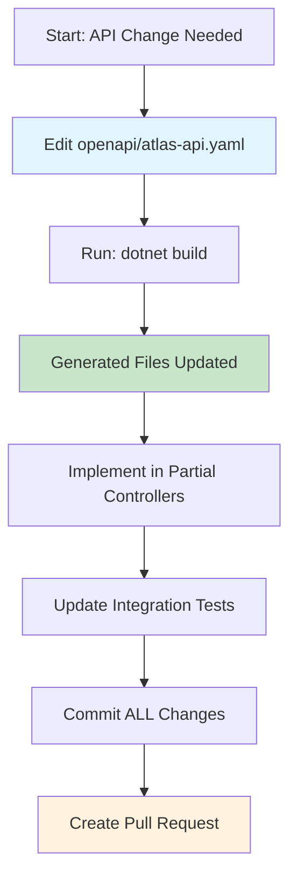

# Contract Governance

## Overview

This document defines the **contract-first development** approach for the ATLAS API. The OpenAPI specification (`openapi/atlas-api.yaml`) is the **single source of truth** for all API changes.

---

## Principles

### 1. Contract-First Development

**ALL** API changes MUST start with `openapi/atlas-api.yaml`.



### 2. Artifact Ownership

| Artifact | Owner | Regenerated? |
|----------|--------|---------------|
| `openapi/atlas-api.yaml` | **Developers** | Never |
| `GeneratedControllers.g.cs` | NSwag | **Yes** (on build) |
| `AtlasContracts.g.cs` | NSwag | **Yes** (on build) |
| `*Controller.partial.cs` | **Developers** | Never |
| `DtoMappingExtensions.cs` | **Developers** | Never |

### 3. Rules

✅ **DO:**
- Update `openapi/atlas-api.yaml` FIRST
- Run `dotnet build` to regenerate artifacts
- Commit YAML + generated files TOGETHER
- Use `scripts/validate-contract.ps1` before pushing

❌ **DON'T:**
- Edit `GeneratedControllers.g.cs` manually
- Edit `AtlasContracts.g.cs` manually
- Commit generated files without YAML changes
- Skip `dotnet build` before committing

---

## Development Workflow

### Starting a New Feature

```bash
# 1. Create feature branch
git checkout -b feature/my-new-endpoint

# 2. Edit OpenAPI spec FIRST
code openapi/atlas-api.yaml

# 3. Regenerate artifacts
dotnet build src/ATLAS.API/ATLAS.Api.csproj

# 4. Implement in partial controller
code src/ATLAS.API/Controllers/Partial/MyController.partial.cs

# 5. Update DTO mappings if needed
code src/ATLAS.API/Contracts/Generated/DtoMappingExtensions.cs

# 6. Update integration tests
code tests/ATLAS.IntegrationTests/API/

# 7. Validate before committing
./scripts/validate-contract.ps1

# 8. Commit ALL changes together
git add openapi/atlas-api.yaml \
         src/ATLAS.API/Controllers/Generated/ \
         src/ATLAS.API/Contracts/Generated/ \
         src/ATLAS.API/Controllers/Partial/ \
         tests/ATLAS.IntegrationTests/
git commit -m "feat: add my new endpoint"
```

### Regeneration Process

**Automatic** (on build):
```xml
<!-- src/ATLAS.API/ATLAS.Api.csproj -->
<Target Name="GenerateOpenApiControllers" BeforeTargets="BeforeBuild">
  <Exec Command="nswag run nswag.json" />
</Target>
```

**Manual** (if needed):
```bash
dotnet build src/ATLAS.API/ATLAS.Api.csproj
```

---

## Pull Request Workflow

### PR Checklist (Required)

```markdown
- [ ] `openapi/atlas-api.yaml` updated (if API change)
- [ ] `dotnet build` passes (regenerates artifacts)
- [ ] Generated files committed (`GeneratedControllers.g.cs`, `AtlasContracts.g.cs`)
- [ ] Partial controllers updated (if needed)
- [ ] DTO mappings updated (if needed)
- [ ] Integration tests updated
- [ ] No manual edits to generated files
- [ ] `scripts/validate-contract.ps1` passes locally
```

### PR Template

The PR template (`.github/PULL_REQUEST_TEMPLATE.md`) includes:
- Contract changes checklist
- Regeneration checklist
- Manual implementation checklist
- Validation checklist

**Always use the PR template when creating pull requests!**

---

## Contract Validation

### CI/CD Pipeline

**File:** `.github/workflows/contract-validation.yml`

**Validation Steps:**

| Step | Tool | Purpose |
|------|------|----------|
| **YAML Validation** | `Microsoft.OpenApi.Tools` | Ensure spec is valid YAML/OpenAPI 3.1 |
| **Regeneration Check** | `git diff` | Ensure generated files match spec |
| **Breaking Change Detection** | `Microsoft.OpenApi.Tools` (`openapi diff`) | Fail PR if breaking change detected |
| **Consistency Check** | `dotnet build` | Ensure partial controllers match interfaces |

### Local Validation

**Script:** `scripts/validate-contract.ps1`

```powershell
# Run before pushing
./scripts/validate-contract.ps1
```

**Checks:**
1. Regenerates artifacts
2. Checks for outdated generated files
3. Validates OpenAPI spec (if tool installed)
4. Checks for manual edits to generated files

---

## Versioning Strategy

### OpenAPI Version

**File:** `openapi/atlas-api.yaml`

```yaml
openapi: 3.1.0
info:
  title: ATLAS API
  version: 1.0.0  # ← Increment this!
```

### Version Increment Rules

| Change Type | Version Bump | Example |
|-------------|---------------|---------|
| **Breaking change** | **MAJOR** (x.0.0) | Remove endpoint, change response type |
| **New feature** | **MINOR** (1.x.0) | Add new endpoint, new optional parameter |
| **Bug fix** | **PATCH** (1.0.x) | Fix typo in description |

### Breaking Change Detection

**Tool:** `Microsoft.OpenApi.Tools` (`openapi diff`)

**Install:**
```bash
dotnet tool install --global Microsoft.OpenApi.Tools
```

**Usage:**
```bash
# Compare against main branch
openapi diff openapi/atlas-api.yaml \
  <(git show main:openapi/atlas-api.yaml) \
  --fail-on-breaking
```

**Breaking changes include:**
- Removing an endpoint
- Changing an endpoint's path
- Changing an endpoint's HTTP method
- Removing/renaming a response field
- Changing a request/response type

**Non-breaking changes:**
- Adding a new endpoint
- Adding a new optional parameter
- Adding a new response field
- Fixing descriptions/typos

---

## Forbidden Practices

❌ **Edit `GeneratedControllers.g.cs` manually**  
❌ **Edit `AtlasContracts.g.cs` manually**  
❌ **Commit generated files without YAML changes**  
❌ **Skip `dotnet build` before committing**  
❌ **Make breaking changes without major version bump**  
❌ **Ignore CI validation failures**  

---

## Recommended Practices

✅ **Always update YAML first**  
✅ **Always run `dotnet build` before committing**  
✅ **Always commit YAML + generated files together**  
✅ **Always check CI validation passes**  
✅ **Always document breaking changes in PR description**  
✅ **Always use `openapi diff` to detect breaking changes**  

---

## Troubleshooting

### Generated Files Are Outdated

**Error:** `ERROR: Generated files are outdated!`

**Fix:**
```bash
dotnet build src/ATLAS.API/ATLAS.Api.csproj
git add src/ATLAS.API/Controllers/Generated/ \
         src/ATLAS.API/Contracts/Generated/
git commit -m "chore: regenerate API artifacts"
```

### Build Fails with NSwag Errors

**Error:** `NSwag.MSBuild.ExitCodeException`

**Fix:**
1. Check `openapi/atlas-api.yaml` syntax
2. Validate YAML: `openapi validate openapi/atlas-api.yaml`
3. Check `nswag.json` configuration

### Partial Controller Doesn't Match Interface

**Error:** `CS0535: 'Controller' does not implement interface member`

**Fix:**
1. Run `dotnet build` to regenerate interface
2. Update partial controller to implement new/changed methods
3. Check method signatures match exactly

### Breaking Change Detected

**Error:** `ERROR: Breaking changes detected!`

**Options:**
1. **Revert breaking change** (recommended)
2. **Bump major version** (if breaking change is intentional)
3. **Document breaking change** in PR description

---

## References

- **OpenAPI Spec:** `openapi/atlas-api.yaml`
- **NSwag Config:** `src/ATLAS.API/nswag.json`
- **Generated Controllers:** `src/ATLAS.API/Controllers/Generated/GeneratedControllers.g.cs`
- **Generated DTOs:** `src/ATLAS.API/Contracts/Generated/AtlasContracts.g.cs`
- **DTO Mappings:** `src/ATLAS.API/Contracts/Generated/DtoMappingExtensions.cs`
- **CI Workflow:** `.github/workflows/contract-validation.yml`
- **Validation Script:** `scripts/validate-contract.ps1`
- **PR Template:** `.github/PULL_REQUEST_TEMPLATE.md`

---

**Last Updated:** 2026-06-08  
**Maintained By:** ATLAS Engineering Team
