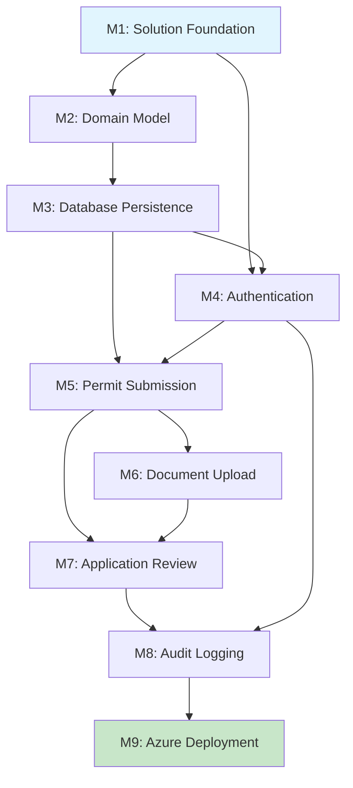

# ATLAS Implementation Roadmap

**Project**: ATLAS (Automated Tracking & Licensing Application System)
**Version**: 1.0
**Date**: June 3, 2026
**Status**: 

---

## Overview

This roadmap outlines the implementation plan for ATLAS MVP as defined in [atlas-mvp-prd.md](docs/PRDs/atlas-mvp-prd.md). The plan follows Clean Architecture (ADR-001), CQRS with MediatR (ADR-002), and Domain-Driven Design (ADR-004).

### Effort Estimation

- **Story Points (SP)**: 1 SP = 0.5 developer day
- Estimates include development, unit testing, and code review
- Does not include buffer for unknowns or technical debt

### Dependency Graph

---

## Milestone 1: Solution Foundation

**Objective**: Establish Clean Architecture solution structure with CI/CD pipeline and development standards.

**Deliverables**:

- .NET 9 solution with 4-layer Clean Architecture projects (Domain, Application, Infrastructure, API/Blazor)
- GitHub Actions CI/CD pipeline (ADR-006: GitHub Actions)
- Coding standards documentation (`.github/instructions/`)
- Solution builds successfully with placeholder projects
- Bicep infrastructure templates scaffold (ADR-007: Bicep)

**Acceptance Criteria**:

- ✅ Solution builds with `dotnet build` with zero errors
- ✅ CI pipeline runs on every PR with build + unit test steps
- ✅ All 4 Clean Architecture layers present (Domain, Application, Infrastructure, Presentation)
- ✅ ADRs 001-004 implemented as documented
- ✅ README.md updated with build/run instructions

**Dependencies**: None

**Estimated Effort**: 5 SP (2.5 developer days)

**PRD Mapping**: N/A (Foundation)

---

## Milestone 2: Domain Model

**Objective**: Implement core domain layer with entities, aggregates, value objects, and domain events following DDD (ADR-004).

**Deliverables**:

- `PermitApplication` aggregate root with state machine (Submitted → UnderReview → Approved/Rejected)
- `PermitType` entity for configurable permit definitions
- `Document` entity with metadata and blob reference
- `ReviewNote` entity for officer comments
- Value objects: `ApplicationStatus`, `DocumentType`, `AuditEntry`
- Domain events: `ApplicationSubmittedEvent`, `ApplicationApprovedEvent`, `ApplicationRejectedEvent`
- Unit tests for all domain logic (≥95% coverage per Quality Policy)

**Acceptance Criteria**:

- ✅ All domain entities implement proper encapsulation (private setters)
- ✅ `PermitApplication` enforces valid state transitions (cannot approve from Draft state)
- ✅ Domain events raised on state changes
- ✅ Value objects are immutable and use value equality
- ✅ 100% test coverage for domain logic (error paths and security logic)
- ✅ No dependencies on external frameworks in Domain layer

**Dependencies**: Milestone 1 (Solution Foundation)

**Estimated Effort**: 13 SP (6.5 developer days)

**PRD Mapping**: F-01, F-02, F-09, F-10 (domain models for these features)

---

## Milestone 3: Database Persistence

**Objective**: Implement Entity Framework Core with Azure SQL Database (ADR-003) and repository pattern.

**Deliverables**:

- EF Core `DbContext` with entity configurations
- Database migrations for initial schema
- Repository implementations (ADR-004): `IPermitApplicationRepository`, `IPermitTypeRepository`, `IDocumentRepository`
- CQRS command/query handlers using MediatR (ADR-002)
- Integration tests with InMemory database provider
- Seed data for permit types

**Acceptance Criteria**:

- ✅ EF Core migrations run successfully against Azure SQL
- ✅ Repository interfaces defined in Application layer, implemented in Infrastructure
- ✅ All CQRS handlers implement proper error handling
- ✅ Integration tests pass with InMemory provider (≥85% coverage for integrations)
- ✅ Database schema matches domain model (no anemic entities)

**Dependencies**: Milestone 2 (Domain Model)

**Estimated Effort**: 13 SP (6.5 developer days)

**PRD Mapping**: F-01, F-02, F-09, F-17, F-18, F-19 (data persistence for these features)

---

## Milestone 4: Authentication

**Objective**: Integrate Microsoft Entra ID (ADR-008) for authentication and role-based authorization.

**Deliverables**:

- Microsoft Entra ID app registration configuration
- Blazor authentication with OpenID Connect
- Role definitions: `Citizen`, `Officer`, `Admin`
- Authorization policies for role-based access
- User profile service to map Entra ID claims to ATLAS roles
- Login/logout UI components

**Acceptance Criteria**:

- ✅ Users can log in with Microsoft Entra ID accounts
- ✅ Role-based authorization enforced (Citizens cannot access officer dashboard)
- ✅ Authentication state persists across browser sessions
- ✅ Unauthorized access returns 403 Forbidden
- ✅ User roles seeded from Entra ID group membership

**Dependencies**: Milestone 1 (Solution Foundation), Milestone 3 (Database Persistence for user profiles)

**Estimated Effort**: 8 SP (4 developer days)

**PRD Mapping**: F-21 (user account management)

---

## Milestone 5: Permit Submission

**Objective**: Implement citizen-facing permit application submission workflow (UC1).

**Deliverables**:

- Permit type selection page (lists active permit types from F-17)
- Permit application form with validation (F-01, F-02)
- Application status dashboard for citizens (F-04, F-05)
- CQRS commands: `SubmitApplicationCommand`, `SaveDraftApplicationCommand`
- Email confirmation on submission (F-06)
- Unit and integration tests

**Acceptance Criteria**:

- ✅ Citizens can select from active permit types only
- ✅ Form validation enforces required fields and data formats
- ✅ Application saves with "Submitted" status
- ✅ Confirmation number generated and displayed
- ✅ Citizens can view their submitted applications with status
- ✅ 100% coverage for error paths (validation failures, duplicate submissions)

**Dependencies**: Milestone 3 (Database Persistence), Milestone 4 (Authentication)

**Estimated Effort**: 13 SP (6.5 developer days)

**PRD Mapping**: F-01, F-02, F-04, F-05, F-06, F-07 (draft applications)

---

## Milestone 6: Document Upload

**Objective**: Implement document upload to Azure Blob Storage (ADR-003) with citizen-facing UI.

**Deliverables**:

- Azure Blob Storage integration for document storage
- Document upload component (drag-and-drop + file picker)
- File validation: PDF, JPG, PNG, max 25MB per file (F-03)
- Document metadata stored in Azure SQL, blobs in Storage
- Document list/view component for citizens (F-08)
- CQRS commands: `UploadDocumentCommand`, `DeleteDocumentCommand`

**Acceptance Criteria**:

- ✅ Citizens can upload PDF/JPG/PNG files up to 25MB
- ✅ Invalid file types rejected with clear error message
- ✅ Documents linked to permit application in database
- ✅ Citizens can download previously uploaded documents (F-08)
- ✅ Blob storage uses private containers with SAS tokens
- ✅ 100% coverage for file validation and security paths

**Dependencies**: Milestone 3 (Database Persistence), Milestone 5 (Permit Submission)

**Estimated Effort**: 10 SP (5 developer days)

**PRD Mapping**: F-03, F-08

---

## Milestone 7: Application Review

**Objective**: Implement permit officer dashboard and review workflow (UC2).

**Deliverables**:

- Officer dashboard with pending application queue (F-09, F-14)
- Application detail view with all form data and documents (F-10)
- Review notes component (internal only, not visible to citizens) (F-11)
- Approve/Reject actions with confirmation (F-12, F-13)
- Status change to "Under Review" when officer opens application
- CQRS commands: `AddReviewNoteCommand`, `ApproveApplicationCommand`, `RejectApplicationCommand`
- Email notifications to citizens on status change (F-06)

**Acceptance Criteria**:

- ✅ Officers see only applications matching their department/assignment (F-09)
- ✅ Officers can add internal notes not visible to citizens
- ✅ Approve action changes status to "Approved" with timestamp
- ✅ Reject action requires reason code and comments (F-13)
- ✅ Application history shows all status changes with officer name
- ✅ 100% coverage for approval/rejection logic and security (officers cannot approve their own submissions)

**Dependencies**: Milestone 5 (Permit Submission), Milestone 6 (Document Upload), Milestone 4 (Authentication for role checks)

**Estimated Effort**: 15 SP (7.5 developer days)

**PRD Mapping**: F-09, F-10, F-11, F-12, F-13, F-14, F-15, F-16

---

## Milestone 8: Audit Logging

**Objective**: Implement comprehensive audit trail for compliance (UC3).

**Deliverables**:

- Audit log entity and repository
- Domain event handlers that persist audit entries
- Audit log viewer for administrators (F-20)
- Audit entries for all critical actions:
  - Application submitted/approved/rejected
  - Documents uploaded/deleted
  - Permit types created/updated/deactivated
  - User login/logout
- Export audit data to CSV (F-23)
- CQRS queries: `GetAuditLogQuery`, `ExportAuditLogQuery`

**Acceptance Criteria**:

- ✅ Every state change (application, permit type) creates audit entry
- ✅ Audit entries are immutable (no update/delete)
- ✅ Administrators can filter audit log by date range, user, action type (F-20)
- ✅ Audit log export generates valid CSV file (F-23)
- ✅ Audit entries include: timestamp, user ID, action type, before/after values
- ✅ 100% coverage for audit logging (critical for compliance)

**Dependencies**: Milestone 7 (Application Review - generates audit events), Milestone 4 (Authentication - user context for audit)

**Estimated Effort**: 10 SP (5 developer days)

**PRD Mapping**: F-20, F-23

---

## Milestone 9: Azure Deployment

**Objective**: Deploy ATLAS to Azure App Service with full infrastructure as code (ADR-007: Bicep).

**Deliverables**:

- Bicep templates for:
  - Azure App Service (Linux)
  - Azure SQL Database (ADR-003)
  - Azure Blob Storage (ADR-003)
  - Microsoft Entra ID app registration
  - Application Insights for monitoring
- GitHub Actions deployment workflow
- Environment configurations (dev, staging, production)
- Database migration strategy (EF Core migrations on deploy)
- Smoke tests post-deployment
- Documentation: deployment guide and rollback procedure

**Acceptance Criteria**:

- ✅ Infrastructure deploys via `az deployment group create` with zero manual steps
- ✅ Application accessible at production URL with valid SSL
- ✅ Database migrations applied automatically on deployment
- ✅ Authentication works with Microsoft Entra ID in production
- ✅ Application Insights collecting telemetry
- ✅ Rollback procedure documented and tested
- ✅ All PRD functional requirements verified in production (F-01 through F-23)

**Dependencies**: Milestone 8 (Audit Logging - last feature milestone)

**Estimated Effort**: 10 SP (5 developer days)

**PRD Mapping**: All functional requirements (end-to-end validation)

---

## Summary

| Milestone | Name | Effort (SP) | Effort (Days) | Dependencies |
| ----------- | ------ | ------------- | --------------- | ------------- |
| M1 | Solution Foundation | 5 | 2.5 | None |
| M2 | Domain Model | 13 | 6.5 | M1 |
| M3 | Database Persistence | 13 | 6.5 | M2 |
| M4 | Authentication | 8 | 4 | M1, M3 |
| M5 | Permit Submission | 13 | 6.5 | M3, M4 |
| M6 | Document Upload | 10 | 5 | M3, M5 |
| M7 | Application Review | 15 | 7.5 | M5, M6, M4 |
| M8 | Audit Logging | 10 | 5 | M7, M4 |
| M9 | Azure Deployment | 10 | 5 | M8 |
| **Total** | | **97 SP** | **48.5 days** | |

**Assumptions**:

- 1 developer working full-time (5 days/week)
- No parallel work streams (sequential milestones)
- Estimated timeline: ~10 weeks for complete MVP

**Risks & Mitigation**:

- **Risk**: Microsoft Entra ID configuration complexity → **Mitigation**: Start M4 early, use dev tenant
- **Risk**: Azure SQL performance tuning → **Mitigation**: Use EF Core logging to identify N+1 queries
- **Risk**: Blob storage cost overruns → **Mitigation**: Implement lifecycle management policy (ADR-003)

---

## Next Steps

1. Review and approve this roadmap
2. Create GitHub issues for each milestone deliverable
3. Set up project board with milestones
4. Begin Milestone 1: Solution Foundation

---

**References**:

- [ATLAS MVP PRD](docs/PRDs/atlas-mvp-prd.md)
- [Clean Architecture ADR](docs/ADRs/adr-001-clean-architecture.md)
- [CQRS with MediatR ADR](docs/ADRs/adr-002-cqrs-mediatr.md)
- [Azure SQL & Blob Storage ADR](docs/ADRs/adr-003-azure-sql-blob.md)
- [Domain-Driven Design ADR](docs/ADRs/adr-004-domain-driven-design.md)
- [Blazor Web App ADR](docs/ADRs/adr-005-blazor-web-app.md)
- [GitHub Actions ADR](docs/ADRs/adr-006-github-actions.md)
- [Bicep ADR](docs/ADRs/adr-007-bicep.md)
- [Microsoft Entra ID ADR](docs/ADRs/adr-008-microsoft-entra-id.md)
- [Quality & Coverage Policy](.github/copilot-instructions.md#quality-policy)

<!-- © Capgemini 2025 -->
