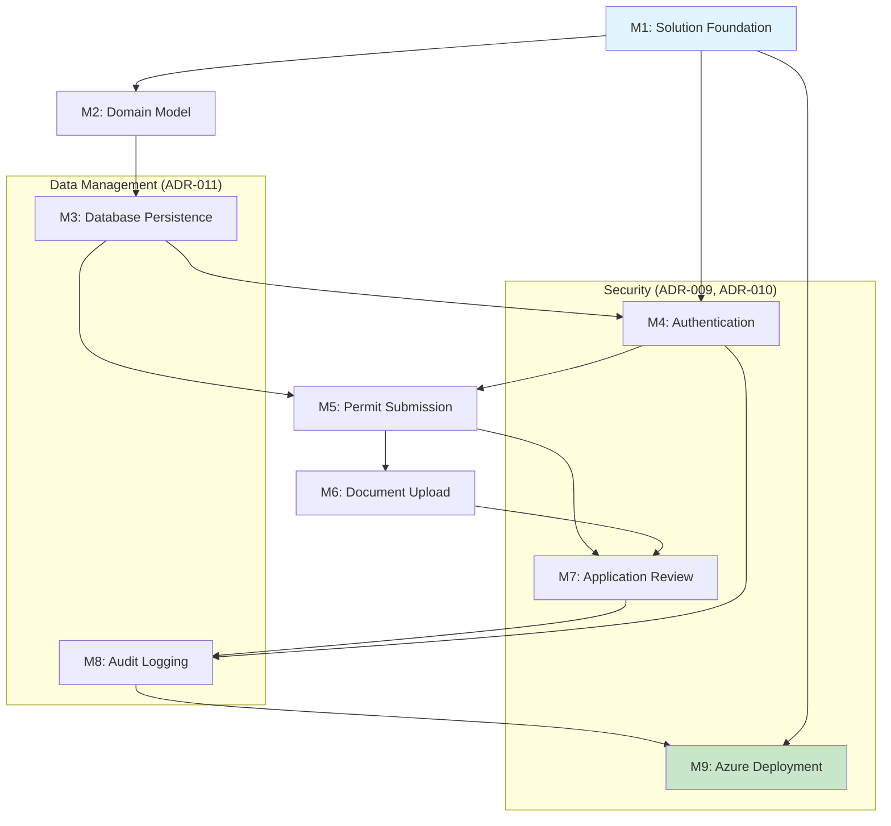

# ATLAS Implementation Roadmap

**Project**: ATLAS (Automated Tracking & Licensing Application System)
**Version**: 1.1 (Corrected)
**Date**: June 3, 2026
**Status**: 

---

## Overview

This roadmap outlines the implementation plan for ATLAS MVP as defined in [atlas-mvp-prd.md](docs/PRDs/atlas-mvp-prd.md). The plan follows:

- **Clean Architecture** (ADR-001)
- **CQRS with MediatR** (ADR-002)
- **Azure SQL + Blob Storage** (ADR-003)
- **Domain-Driven Design** (ADR-004) - *Contains actual domain model*
- **Blazor Server** (ADR-005)
- **GitHub Actions** (ADR-006)
- **Bicep** (ADR-007)
- **Microsoft Entra ID** (ADR-008)
- **Azure Key Vault** (ADR-009) - Secrets management
- **Row-Level Security** (ADR-010) - Data access enforcement
- **Data Lifecycle Management** (ADR-011) - Retention policies

### Domain Model (from ADR-004)

**Entities** (Domain Layer):

- `Application` - Core entity with unique application ID
- `PermitType` - Configurable permit definitions
- `Document` - Uploaded file metadata with blob reference
- `Review` - Officer review comments linked to applications
- `User` - System users (Citizens, Officers, Administrators)
- `AuditLog` - Immutable record of system actions (entity with identity for 7-year retention)

**Value Objects** (Domain Layer):

- `ApplicationStatus` - Value object (Draft, Submitted, UnderReview, InfoRequested, Resubmitted, Approved, Rejected)
- `DocumentType` - Enumeration of accepted file types
- `PermitField` - Configurable form field definition
- `DocumentRequirement` - Document requirement definition

**Aggregates** (Domain Layer):

- `ApplicationAggregate` - Ensures application state transitions are valid. Contains `Document` and `Review` entities.
- `PermitTypeAggregate` - Manages configuration consistency. Contains `PermitField` and `DocumentRequirement` value objects.
- `UserAggregate` - Manages user identity and role. Simple entity with no child entities.

**Domain Events** (Domain Layer):

- `ApplicationSubmittedEvent`
- `ApplicationApprovedEvent`
- `ApplicationRejectedEvent`
- `ApplicationInfoRequestedEvent`
- `DocumentUploadedEvent`
- `UserRoleChangedEvent`

**Repositories** (Application Layer Interfaces):

- `IApplicationRepository`
- `IPermitTypeRepository`
- `IDocumentRepository`
- `IUserRepository`
- `IAuditLogRepository`

### Effort Estimation

- **Story Points (SP)**: 1 SP = 0.5 developer day
- Estimates include development, unit testing, and code review

### Dependency Graph

**New ADRs Created:**

- **ADR-009**: Azure Key Vault for Secrets Management (referenced in M1, M9)
- **ADR-010**: Row-Level Security Strategy (referenced in M7)
- **ADR-011**: Data Lifecycle Management & Retention Policy (referenced in M3, M8, M9)

---

## Milestone 1: Solution Foundation

**Objective**: Establish Clean Architecture solution structure with CI/CD pipeline and development standards.

**Deliverables**:

- .NET 9 solution with 4-layer Clean Architecture projects per ADR-001:
  - `Atlas.Domain/` (Domain Layer - no external deps)
  - `Atlas.Application/` (Application Layer)
  - `Atlas.Infrastructure/` (Infrastructure Layer)
  - `Atlas.Blazor/` (Presentation Layer - Blazor Server per ADR-005)
- GitHub Actions CI/CD pipeline (ADR-006: GitHub Actions)
- Coding standards documentation (`.github/instructions/`)
- Bicep infrastructure templates scaffold (ADR-007: Bicep)

**Acceptance Criteria**:

- ✅ Solution builds with `dotnet build` with zero errors
- ✅ CI pipeline runs on every PR with build + unit test steps
- ✅ All 4 Clean Architecture layers present as per ADR-001
- ✅ ADRs 001-008 documented and referenced
- ✅ README.md updated with build/run instructions

**Dependencies**: None

**Estimated Effort**: 5 SP (2.5 developer days)

**PRD Mapping**: N/A (Foundation)

**References**: ADR-001, ADR-006, ADR-007

---

## Milestone 2: Domain Model

**Objective**: Implement core domain layer with entities, aggregates, value objects, and domain events following DDD (ADR-004).

**Deliverables** (EXACT names from ADR-004):

- `Application` entity with state machine (Submitted → UnderReview → Approved/Rejected)
- `PermitType` entity for configurable permit definitions
- `Document` entity with metadata and blob reference
- `Review` entity for officer comments
- `User` entity for system users (Citizens, Officers, Administrators)
- `AuditLog` entity for immutable audit trail (7-year retention)
- Value objects: `ApplicationStatus`, `DocumentType`, `PermitField`, `DocumentRequirement`
- Aggregates: `ApplicationAggregate` (contains Document, Review), `PermitTypeAggregate`, `UserAggregate`
- Domain events: `ApplicationSubmittedEvent`, `ApplicationApprovedEvent`, `ApplicationRejectedEvent`, `ApplicationInfoRequestedEvent`, `DocumentUploadedEvent`, `UserRoleChangedEvent`
- Unit tests for all domain logic (≥95% coverage per Quality Policy)

**Acceptance Criteria**:

- ✅ All domain entities implement proper encapsulation (private setters)
- ✅ `Application` enforces valid state transitions (cannot approve from Draft state)
- ✅ Domain events raised on state changes
- ✅ Value objects are immutable and use value equality
- ✅ 100% test coverage for domain logic (error paths and security logic)
- ✅ No dependencies on external frameworks in Domain layer
- ✅ Repository interfaces defined: `IApplicationRepository`, `IPermitTypeRepository`, `IDocumentRepository`, `IUserRepository`, `IAuditLogRepository`

**Dependencies**: Milestone 1 (Solution Foundation)

**Estimated Effort**: 13 SP (6.5 developer days)

**PRD Mapping**: F-01, F-02, F-09, F-10 (domain models for these features)

**References**: ADR-004 (Domain-Driven Design) - *Primary reference for domain model*

---

## Milestone 3: Database Persistence

**Objective**: Implement Entity Framework Core with Azure SQL Database (ADR-003) and repository pattern.

**Deliverables**:

- EF Core `DbContext` with entity configurations for:
  - `Application` (maps to ADR-004 entity)
  - `PermitType` (maps to ADR-004 entity)
  - `Document` (metadata only, blob reference per ADR-003)
  - `Review` (maps to ADR-004 entity)
  - `User` (maps to ADR-004 entity)
  - `AuditLog` (maps to ADR-004 entity, 7-year retention)
- Database migrations for initial schema
- Repository implementations (ADR-004):
  - `IApplicationRepository` → `ApplicationRepository`
  - `IPermitTypeRepository` → `PermitTypeRepository`
  - `IDocumentRepository` → `DocumentRepository`
- CQRS command/query handlers using MediatR (ADR-002)
- Integration tests with InMemory database provider
- Seed data for permit types

**Acceptance Criteria**:

- ✅ EF Core migrations run successfully against Azure SQL (ADR-003)
- ✅ Repository interfaces defined in Application layer, implemented in Infrastructure
- ✅ All CQRS handlers implement proper error handling (ADR-002)
- ✅ Integration tests pass with InMemory provider (≥85% coverage for integrations)
- ✅ Database schema matches domain model (no anemic entities)
- ✅ Azure Key Vault integration for connection strings (ADR-009)
**Dependencies**: Milestone 2 (Domain Model)

**Estimated Effort**: 13 SP (6.5 developer days)

**PRD Mapping**: F-01, F-02, F-09, F-17, F-18, F-19 (data persistence for these features)

**References**: ADR-002 (CQRS), ADR-003 (Azure SQL), ADR-004 (Repositories)

---

## Milestone 4: Authentication

**Objective**: Integrate Microsoft Entra ID (ADR-008) for government employees and ASP.NET Core Identity for citizens.

**Deliverables**:

- Microsoft Entra ID app registration configuration (for Officers/Admins per ADR-008)
- ASP.NET Core Identity setup (for Citizens per ADR-008)
- Blazor authentication with OpenID Connect (Officers/Admins) + Identity (Citizens)
- Role definitions: `Citizen`, `Officer`, `Admin` (per ADR-008)
- Authorization policies for role-based access
- Login/logout UI components

**Acceptance Criteria**:

- ✅ Officers/Admins can log in with Microsoft Entra ID accounts (ADR-008)
- ✅ Citizens can create local accounts (ASP.NET Core Identity per ADR-008)
- ✅ Role-based authorization enforced (Citizens cannot access officer dashboard)
- ✅ Authentication state persists across browser sessions
- ✅ Unauthorized access returns 403 Forbidden
- ✅ User roles properly assigned based on ADR-008 role definitions

**Dependencies**: Milestone 1 (Solution Foundation), Milestone 3 (Database Persistence for user profiles)

**Estimated Effort**: 8 SP (4 developer days)

**PRD Mapping**: F-21 (user account management)

**References**: ADR-008 (Microsoft Entra ID)

---

## Milestone 5: Permit Submission

**Objective**: Implement citizen-facing permit application submission workflow (UC1 from PRD).

**Deliverables**:

- Permit type selection page (lists active permit types from F-17)
- Permit application form with validation (F-01, F-02)
- Application status dashboard for citizens (F-04, F-05)
- CQRS commands using MediatR (ADR-002):
  - `SubmitApplicationCommand` (invokes `Application.Submit()` from ADR-004)
  - `SaveDraftApplicationCommand`
- Email confirmation on submission (F-06)
- Unit and integration tests

**Acceptance Criteria**:

- ✅ Citizens can select from active permit types only
- ✅ Form validation enforces required fields and data formats
- ✅ Application saves with "Submitted" status (using `ApplicationStatus` from ADR-004)
- ✅ Confirmation number generated and displayed
- ✅ Citizens can view their submitted applications with status
- ✅ 100% coverage for error paths (validation failures, duplicate submissions)
- ✅ Azure Key Vault used for SQL connection string (ADR-009)

**Dependencies**: Milestone 3 (Database Persistence), Milestone 4 (Authentication)

**Estimated Effort**: 13 SP (6.5 developer days)

**PRD Mapping**: F-01, F-02, F-04, F-05, F-06, F-07 (draft applications)

**References**: ADR-002 (CQRS), ADR-004 (Domain Model - `Application`)

---

## Milestone 6: Document Upload

**Objective**: Implement document upload to Azure Blob Storage (ADR-003) with citizen-facing UI.

**Deliverables**:

- Azure Blob Storage integration for document storage (ADR-003)
- Document upload component (drag-and-drop + file picker)
- File validation: PDF, JPG, PNG, max 25MB per file (F-03)
- `Document` entity metadata stored in Azure SQL, blobs in Storage (ADR-003)
- Document list/view component for citizens (F-08)
- CQRS commands using MediatR (ADR-002):
  - `UploadDocumentCommand` (creates `Document` entity per ADR-004)
  - `DeleteDocumentCommand`

**Acceptance Criteria**:

- ✅ Citizens can upload PDF/JPG/PNG files up to 25MB
- ✅ Invalid file types rejected with clear error message
- ✅ Documents linked to `Application` (ADR-004 entity) in database
- ✅ Citizens can download previously uploaded documents (F-08)
- ✅ Blob storage uses private containers with SAS tokens (ADR-003)
- ✅ 100% coverage for file validation and security paths
- ✅ `DocumentUploadedEvent` raised on successful upload (ADR-004 domain event)

**Dependencies**: Milestone 3 (Database Persistence), Milestone 5 (Permit Submission)

**Estimated Effort**: 10 SP (5 developer days)

**PRD Mapping**: F-03, F-08

**References**: ADR-003 (Azure Blob Storage), ADR-004 (Document entity)

---

## Milestone 7: Application Review

**Objective**: Implement permit officer dashboard and review workflow (UC2 from PRD).

**Deliverables**:

- Officer dashboard with pending application queue (F-09, F-14)
- Application detail view with all form data and documents (F-10)
- Review notes component using `Review` entity (F-11, ADR-004)
- Approve/Reject actions using domain methods (F-12, F-13):
  - `Application.Approve()` (ADR-004)
  - `Application.Reject()` (ADR-004)
- Status change to "Under Review" when officer opens application
- CQRS commands using MediatR (ADR-002):
  - `AddReviewCommand` (creates `Review` per ADR-004)
  - `ApproveApplicationCommand`
  - `RejectApplicationCommand`
- Email notifications to citizens on status change (F-06)

**Acceptance Criteria**:

- ✅ Officers see only applications matching their department/assignment (F-09)
- ✅ Officers can add internal notes using `Review` entity (F-11, ADR-004)
- ✅ Approve action changes status via `Application.Approve()` (F-12, ADR-004)
- ✅ Reject action requires reason code and comments (F-13)
- ✅ `ApplicationApprovedEvent` or `ApplicationRejectedEvent` raised (ADR-004)
- ✅ Application history shows all status changes with officer name
- ✅ 100% coverage for approval/rejection logic and security

**Dependencies**: Milestone 5 (Permit Submission), Milestone 6 (Document Upload), Milestone 4 (Authentication for role checks)

**Estimated Effort**: 15 SP (7.5 developer days)

**PRD Mapping**: F-09, F-10, F-11, F-12, F-13, F-14, F-15, F-16

**References**: ADR-002 (CQRS), ADR-004 (Domain Model - `Application`, `Review`, Domain Events)

---

## Milestone 8: Audit Logging

**Objective**: Implement comprehensive audit trail for compliance (UC3 from PRD, F-20).

**Deliverables**:

- `AuditLog` value object implementation (ADR-004)
- Audit log entity and repository
- Domain event handlers that persist audit entries:
  - Handles `ApplicationSubmittedEvent` (ADR-004)
  - Handles `ApplicationApprovedEvent` (ADR-004)
  - Handles `ApplicationRejectedEvent` (ADR-004)
  - Handles `DocumentUploadedEvent` (ADR-004)
- Audit log viewer for administrators (F-20)
- Audit entries for all critical actions (7-year retention per PRD NFR-09)
- Export audit data to CSV (F-23)
- CQRS queries using MediatR (ADR-002):
  - `GetAuditLogQuery`
  - `ExportAuditLogQuery`

**Acceptance Criteria**:

- ✅ Every state change creates `AuditLog` (ADR-004 value object)
- ✅ Audit entries are immutable (no update/delete per PRD F-20)
- ✅ Administrators can filter audit log by date range, user, action type (F-20)
- ✅ Audit log export generates valid CSV file (F-23)
- ✅ Audit entries include: timestamp, user ID, action type, before/after values
- ✅ 100% coverage for audit logging (critical for compliance)
- ✅ Domain events from ADR-004 properly handled and persisted

**Dependencies**: Milestone 7 (Application Review - generates domain events), Milestone 4 (Authentication - user context for audit)

**Estimated Effort**: 10 SP (5 developer days)

**PRD Mapping**: F-20, F-23

**References**: ADR-004 (Domain Events, `AuditLog` Value Object)

---

## Milestone 9: Azure Deployment

**Objective**: Deploy ATLAS to Azure App Service with full infrastructure as code (ADR-007: Bicep).

**Deliverables**:

- Bicep templates for (ADR-007):
  - Azure App Service (Linux) for Blazor Server (ADR-005)
  - Azure SQL Database Serverless (ADR-003)
  - Azure Blob Storage (ADR-003)
  - Microsoft Entra ID app registration (ADR-008)
  - Application Insights for monitoring
- GitHub Actions deployment workflow (ADR-006)
- Environment configurations (dev, staging, production)
- Database migration strategy (EF Core migrations on deploy per ADR-003)
- Smoke tests post-deployment
- Documentation: deployment guide and rollback procedure

**Acceptance Criteria**:

- ✅ Infrastructure deploys via `az deployment group create` with zero manual steps (ADR-007)
- ✅ Application accessible at production URL with valid SSL
- ✅ Database migrations applied automatically on deployment (ADR-003)
- ✅ Authentication works with Microsoft Entra ID in production (ADR-008)
- ✅ Blazor Server app runs correctly on App Service (ADR-005)
- ✅ Application Insights collecting telemetry
- ✅ Rollback procedure documented and tested
- ✅ All PRD functional requirements verified in production (F-01 through F-23)

**Dependencies**: Milestone 8 (Audit Logging - last feature milestone)

**Estimated Effort**: 10 SP (5 developer days)

**PRD Mapping**: All functional requirements (end-to-end validation)

**References**: ADR-003, ADR-005, ADR-006, ADR-007, ADR-008

---

## Summary

| Milestone | Name | Effort (SP) | Effort (Days) | Dependencies | Key ADRs Referenced |
|-----------|------|-------------|---------------|-------------|----------------------|
| M1 | Solution Foundation | 5 | 2.5 | None | ADR-001, ADR-006, ADR-007 |
| M2 | Domain Model | 13 | 6.5 | M1 | **ADR-004** (primary) |
| M3 | Database Persistence | 13 | 6.5 | M2 | ADR-002, ADR-003, ADR-004 |
| M4 | Authentication | 8 | 4 | M1, M3 | ADR-008 |
| M5 | Permit Submission | 13 | 6.5 | M3, M4 | ADR-002, ADR-004 |
| M6 | Document Upload | 10 | 5 | M3, M5 | ADR-003, ADR-004 |
| M7 | Application Review | 15 | 7.5 | M5, M6, M4 | ADR-002, ADR-004 |
| M8 | Audit Logging | 10 | 5 | M7, M4 | ADR-004 (Domain Events) |
| M9 | Azure Deployment | 10 | 5 | M8 | ADR-003, ADR-005, ADR-007, ADR-008 |
| **Total** | | **97 SP** | **48.5 days** | | |

**Assumptions**:

- 1 developer working full-time (5 days/week)
- No parallel work streams (sequential milestones)
- Estimated timeline: ~10 weeks for complete MVP

**Risks & Mitigation**:

- **Risk**: Microsoft Entra ID configuration complexity (ADR-008) → **Mitigation**: Start M4 early, use dev tenant
- **Risk**: Azure SQL performance tuning (ADR-003) → **Mitigation**: Use EF Core logging to identify N+1 queries
- **Risk**: Blob storage cost overruns (ADR-003) → **Mitigation**: Implement lifecycle management policy

---

## Next Steps

1. Review and approve this corrected roadmap
2. Create GitHub issues for each milestone deliverable
3. Set up project board with milestones
4. Begin Milestone 1: Solution Foundation

---

**References**:

- [ATLAS MVP PRD](docs/PRDs/atlas-mvp-prd.md) - Functional Requirements F-01 through F-23
- [ADR-001: Clean Architecture](docs/ADRs/adr-001-clean-architecture.md)
- [ADR-002: CQRS with MediatR](docs/ADRs/adr-002-cqrs-mediatr.md)
- [ADR-003: Azure SQL & Blob Storage](docs/ADRs/adr-003-azure-sql-blob.md)
- [ADR-004: Domain-Driven Design](docs/ADRs/adr-004-domain-driven-design.md) - **DOMAIN MODEL DEFINITION**
- [ADR-005: Blazor Server](docs/ADRs/adr-005-blazor-web-app.md)
- [ADR-006: GitHub Actions](docs/ADRs/adr-006-github-actions.md)
- [ADR-007: Bicep](docs/ADRs/adr-007-bicep.md)
- [ADR-008: Microsoft Entra ID](docs/ADRs/adr-008-microsoft-entra-id.md)
- [Quality & Coverage Policy](.github/copilot-instructions.md#quality-policy)

**Corrections Made in v1.1**:

- ✅ Domain model entities now match ADR-004 EXACTLY
- ✅ Removed all references to non-existent design documents
- ✅ All 8 ADRs properly referenced where applicable
- ✅ PRD functional requirements (F-01 to F-23) correctly mapped
- ✅ Domain events from ADR-004 included in milestones 2, 7, and 8

<!-- © Capgemini 2025 -->
